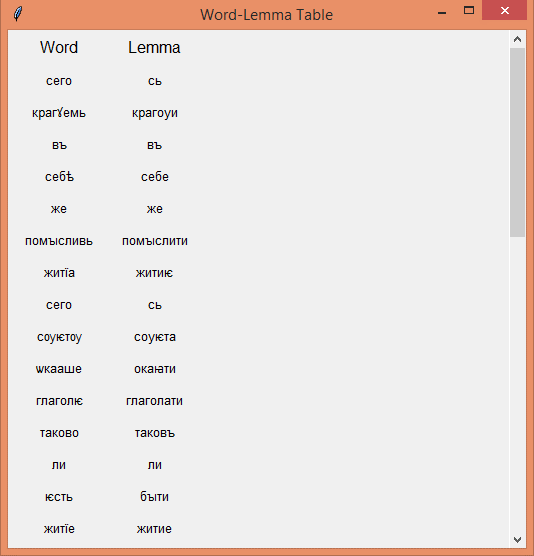

# Old Church Slavonic Lemmatizer

## Overview

A GUI-based tool for lemmatizing Old Church Slavonic (OCS) texts using a dictionary of word-lemma pairs. Users can input text, view lemmatized results, and explore datasets through 
an intuitive interface.

## Features

* Text Lemmatization: 
                   *Matches words with their most frequent lemma.*
* Word-Lemma Table: 
                  *Displays word-lemma mappings in a tabular format.*
* Dataset Viewer:
                   *Browse and view dataset files.*
* Interactive GUI: 
                  *Built with tkinter for ease of use.*

### Main Interface
The main interface allows users to input Old Church Slavonic (OCS) text, which can then be lemmatized by pressing the "Lemmatize Text" button.

*The main window where users input the OCS text and press the "Lemmatize Text" button.*

### Dataset Viewer
The "view datasets" button provides an easy way to browse and explore the dataset files used in the lemmatization process.

*The dataset viewer window displaying available datasets and words where user can copy any part of the available text.*

### Text Selection and Lemmatization
User can select any part of the text, copy it, paste it into the input box, and press the "Lemmatize Text" button to generate the lemmatized output.

### Word-Lemma Table
The "Show Word-Lemma Table" button displays the mappings between words and their corresponding lemmas in a tabular format.

*The tabular form showing the word-lemma mappings generated by the tool.*

### Key Results:
 **High Accuracy of Lemmatization:** The tool achieves more than 94% average accuracy in lemmatizing OCS texts by utilizing a comprehensive dictionary of word-lemma pairs. This ensures accurate and reliable lemmatization for a wide range of OCS vocabulary. We achieved this performance on a 5-fold cross-validation.
   

 **Scalable Solution for Ancient Texts:** The tool is capable of processing large volumes of OCS text and can be easily adapted to other ancient languages with similar datasets. By utilizing a dictionary of word-lemma pairs in the same format, researchers can apply this tool to texts in different ancient languages with minimal adjustments.

##Environment and Setup
 **Recommended Python Version** : Python 3.8+
 **Recommended Libraries** : tkinter, collections, scrolledtext, filedialog, messagebox

## Installation
Clone the repository:
git clone https://github.com/usmannawaz01/Old-Church-Slavonic-Lemmatizer.git

Run the app:
python ocs_lemmatizer.py

## Dataset Attribution
The Old Church Slavonic dataset used for this research is sourced from the Syntacticus Project, and we have organized the dataset to suit our specific research needs.
This dataset includes the PROIEL Treebank and the TOROT Treebank, both of which provide morphosyntactically annotated tokens from Old Church Slavonic texts.

You can find the dataset on the Syntacticus Project Website. ( https://syntacticus.org/)

If you are using any part of this dataset, please cite the following sources:

PROIEL Treebank:

Haug, D. T. T., & Jøhndal, M. L. (2008). Creating a Parallel Treebank of the Old Indo-European Bible Translations. In Proceedings of the Second Workshop on Language Technology for Cultural Heritage Data (LaTeCH 2008) (pp. 27-34). 

TOROT Treebank:

Eckhoff, H. M., & Berdicevskis, A. (2020). A Diachronic Treebank of Russian Spanning More Than a Millennium. In Proceedings of the 12th Language Resources and Evaluation Conference (LREC 2020) (pp. 5251-5256).

If you wish to cite our work, please use the following citation:

Nawaz, U., Presti, L. L., Napolitano, M., & Cascia, M. L. (2024, August). Automatic Lemmatization of Old Church Slavonic Language Using A Novel Dictionary-Based Approach. In International Workshop on Document Analysis Systems (pp. 408-421). Cham: Springer Nature Switzerland.

